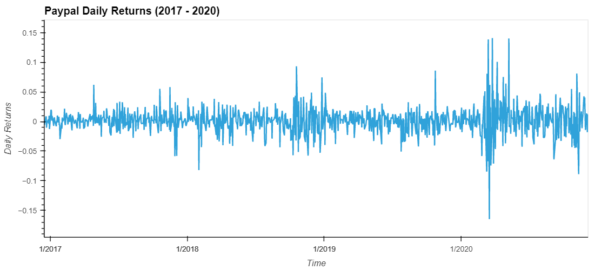
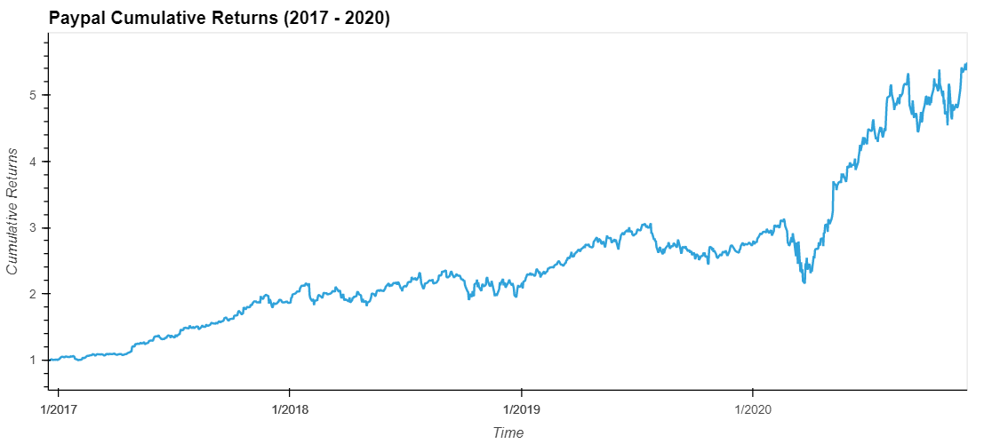
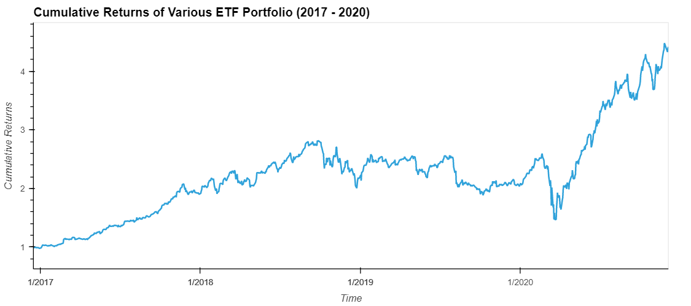

# ETF Analyzer

## Summary

This notebook contains a short analysis of four different stocks in an exchange-traded fund (ETF) portfolio. The fund has holdings in Green Dot Corporation (GDOT), Goldman Sachs Group, Inc (GS), Paypal Holdings, Inc (PYPL) and Block, Inc (SQ, formerly Square, Inc). The anaylsis will show the daily returns of the ETF as well as the cumulative returns over the years of 2017 to 2020.

 

## Charts

Within the notebook are a few interactive charts detailing various returns of an individual stock within the ETF (in this case, Paypal) and the cumulative returns of the ETF as a whole. Below are the charts taken from the notebook.

 
Paypal Daily Returns:

 
Paypal Cumulative Returns:

 
ETF Portfolio Cumulative Returns:

 

## Web Application

In addition to accessing the notebook, it can also be ran as a web server as seen in the recording below.

